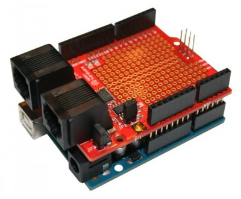

# CANdiy-Shield
The CANdiy-Shield is a plug-on module for Arduino with CAN-Bus (Controller Area Network) connectivity.

* Microchip CAN Controller (SPI)
* Microchip CAN Transceiver
* Switchable between 3V3 or 5V logic level (only CANdiy-Shield v2)
* 2 CAN connectors (RJ45)
* Prototyping Area
* Compatible with all Arduino Boards (SPI connection via 6-Pin ISP connector)
* Open-Source and released under the [Creative Commons Attribution Share-Alike License](https://creativecommons.org/licenses/by-sa/4.0/).
* shop here: [shop](https://shop.watterott.com/CANdiy-Shield-V2-CAN-Bus-Shield)
* **[Documentation on learn.watterott.com](https://learn.watterott.com/shields/candiy-shield/)**

  
* Arduino Libraries and Examples *(Pins: CS = D10, INT = D2)*  
  - MCP2515: [MCP2515](<https://learn.watterott.com/arduino/watterott-libs/>), [Arduino-MCP2515](<https://github.com/autowp/arduino-mcp2515>), [CAN\_BUS\_Shield](<https://github.com/Seeed-Studio/CAN_BUS_Shield>)  
  - MCP2517FD: [ACAN2517](<https://github.com/pierremolinaro/acan2517>), [ACAN2517FD](<https://github.com/pierremolinaro/acan2517FD>), [IMCTFD](<https://github.com/tonton81/IMCTFD>), [MCP2517FD](<https://github.com/SalahEddineBOURAGBA/MCP2517FD>)

    <!-- -->

- RJ45 Pinout:  

<!-- -->

